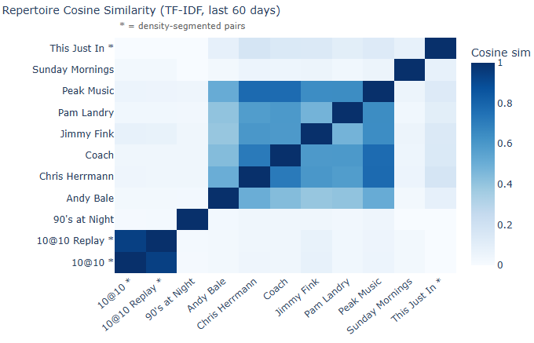
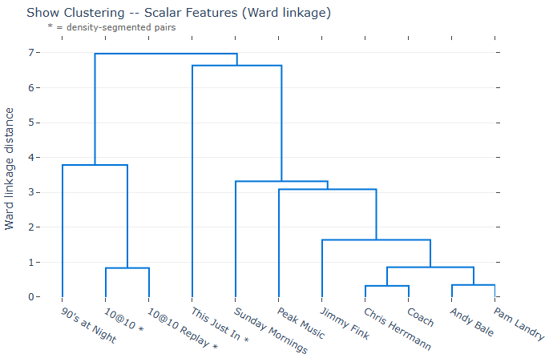

# ANALYSIS.md - Radio Programming Analytics: Findings and Methods

Running record of analytical work, methods, and findings for the radio programming
pipeline. Updated as new analyses are built.

------------------------------------------------------------------------

## Show Clustering

**Script:** `analytics/show_clustering.py`
**Run:** `python rs_main.py cluster`
**Outputs:** `analytics/outputs/clustering/`

### Question

Are the 11 station shows meaningfully differentiated in how they program music,
and if so, along what dimensions?

### Method

Four clustering passes, each using Ward linkage hierarchical clustering. The clustering
machinery is standard; the work is in the feature engineering decisions.

**Scalar features**

Six features covering distinct dimensions of programming structure:

| Feature | What it captures |
|---|---|
| `median_best_year` | Era center -- when the music is from (median; robust to outlier plays) |
| `exclusive_artist_pct` | Show identity -- share of the artist roster that appears on no other show |
| `era_continuity_mean_gap` | Era mixing -- average year gap between consecutive plays within a broadcast day |
| `era_spread` | Era breadth -- std dev of `best_year`; how wide the era window is |
| `rotation_depth` | Repeat cycle -- average plays per unique canonical track over the 60-day window |
| `band_age_score` | Career maturity -- composite: z-scored median and IQR of band_age, averaged |

All features z-scored before distance calculation. Euclidean distance, Ward linkage.

Three features were diagnosed and removed from the original model:

| Feature | Why removed |
|---|---|
| `unique_artists_per_hour` | Airtime-contaminated. Shows with fewer broadcast hours score artificially high because they log fewer total plays -- a species-area effect. The metric measures show length as much as curation breadth. |
| `artist_entropy` | Near-flat for 9 of 11 shows. The two outliers it captured are already separated by `era_spread`. |
| `freshness_pct` | Redundant once `median_best_year` and `era_spread` are both in the model. |

The UAPH removal had a directly measurable consequence. With it in the model, Sunday
Mornings Over Easy was held in the specialty outlier cluster alongside 90s at Night and
This Just In, because its limited broadcast footprint produced an artificially high
per-hour artist count. Removing it let the remaining five features resolve what they
already agreed on: Sunday Mornings programs with the same era range, rotation depth,
and era-mixing pattern as the weekday rotation core. The k=3 cophenetic gap improved
from 1.002 to 2.798 -- a larger gap indicates greater model confidence in where to cut.

**Repertoire similarity: TF-IDF**

The initial approach used binary indicator vectors: top-10 most-played artists and
top-20 most-played tracks per show, union vocabulary across all 11 shows. The problem
is that the station's shared rotation backbone -- REM, RHCP, Oasis, Beck, Black Crowes
-- appears in every show at similar rates. In a binary vector each of these counts
equally with a show-exclusive artist, inflating cross-cluster similarity uniformly.

TF-IDF handles this by natural analogy to the stop-word problem in text retrieval:
IDF assigns near-zero weight to artists that appear across all shows, because ubiquitous
entries carry no discriminating information. TF weights by relative play frequency within
each show, so an artist who accounts for 8% of a show's plays contributes meaningfully
even if they appear in other shows at 1%.

The improvement is quantifiable. The 10@10 / 10@10 Weekend Replay pair -- the Replay is
a literal rebroadcast -- went from 0.700 cosine similarity to 0.928. Their similarity
with the weekday rotation shows dropped from 0.40-0.47 to 0.07-0.10. The cluster
assignments did not change. The binary approach was not structurally wrong; it was
diluted by the shared backbone.

A secondary bug was fixed in the process: the original `compute_repertoire_similarity()`
re-queried raw plays from the database, bypassing the segmentation pipeline. Density-
segmented shows (10@10, This Just In) were contributing their full hour-blocks, including
bleed tracks, to the repertoire vectors. The function now accepts the pre-segmented
dataframe from the caller.

Full artist and track vocabulary is used; IDF naturally handles the long tail.

**Passes**

1. **Scalar only** -- six features above, z-scored, Euclidean distance, Ward linkage
2. **Repertoire only** -- TF-IDF cosine similarity, Ward linkage
3. **Combined, unweighted** -- scalar features concatenated with a 2-dimensional MDS
   embedding of the repertoire similarity matrix, all features z-scored. Repertoire
   signal gets a 2:6 vote share vs. the scalar family.
4. **Combined, equal-weight** -- same as Pass 3, MDS coordinates multiplied by 3 before
   rescaling to give repertoire approximately equal influence. Tests whether the Pass 3
   structure is an artifact of scalar overweighting.

### Findings

**Three-cluster structure, consistent across all four passes:**

| Cluster | Shows | Defining characteristic |
|---|---|---|
| Era-segmented | 10@10, 10@10 Weekend Replay, 90s at Night | Single-era or decade-locked formats |
| Weekday rotation core | Coach, Peak Music, Chris Herrmann, Jimmy Fink, Pam Landry, Andy Bale, Sunday Mornings Over Easy | Wide-era rotation, contemporary catalog center |
| Contemporary specialist | This Just In with Meg White | Near-zero era spread, 100% freshness |

**Feature values by cluster:**

`era_continuity_mean_gap` cleanly separates all three formats. This Just In: 0.34 years.
Era-segmented shows: 0.60-3.45 years. Weekday rotation: 24.9-28.9 years. Shows that stay
in their era have near-zero gaps between consecutive plays; wide-rotation shows jump
decades with almost every track.

`era_spread` (std dev of `best_year`) tells the same story: 0.51 (This Just In) -- 
effectively a single release year -- vs. 3.68-10.23 (era-segmented) vs. 19.4-20.8
(weekday rotation). 10@10 sits in the middle of the era-segmented cluster: wider than
90s at Night because the show mixes 70s and 80s decades, but narrow compared to the
weekday rotation.

`rotation_depth` (plays per unique canonical track): Peak Music (4.85) plays the deepest
rotation in the dataset. This Just In (4.68) is nearly as deep, for a structurally
different reason -- a contemporary-only format with a narrow catalog of recent tracks
cycling frequently. 90s at Night (1.01) is the opposite: nearly every play in the 60-day
window is a unique canonical track, consistent with a large decade-spanning library cycling
slowly.

`band_age_score`: This Just In scores 2.11 (contemporary acts, early career). 90s at Night
scores -1.26 (established acts recorded decades before). Sunday Mornings Over Easy scores
1.08 -- folk and acoustic catalog skews toward mature artists.

**Sunday Mornings Over Easy**

The most analytically interesting reassignment. Sunday Mornings programs folk, acoustic,
and Americana -- Grateful Dead, Bob Dylan, Norah Jones, Iron and Wine -- a clearly distinct
format from the contemporary-rock weekday rotation. But the scalar features place it firmly
in the weekday core. Its `median_best_year` (2007), `era_spread` (20.75), and
`era_continuity_mean_gap` (26.71) are indistinguishable from Coach or Pam Landry.

The dimension that separates it is `exclusive_artist_pct`: 28.2%, vs. 0.7-4.4% for the
rest of the weekday core. Sunday Mornings draws from a distinct artist roster, but uses
the same era-mixing and rotation structure as any other weekday show. The TF-IDF
repertoire similarity confirms this: it does not cluster tightly with the weekday shows
on content, but on operational programming metrics it is not an outlier.

**Cluster robustness**

Passes 3 and 4 -- unweighted vs. equal-weight combined -- produce identical cluster
assignments despite the repertoire signal's influence tripling between them. The scalar
and repertoire dimensions are not in tension. Shows that program similarly on structure
also program similarly on content. The cluster structure is not an artifact of feature
weighting.

### Key insight

The scalar features capture *how* a show is programmed: era center, era breadth, rotation
speed, artist exclusivity. The repertoire features capture *what* is programmed. For the
era-segmented and contemporary-specialist shows both dimensions agree strongly: narrow era
range is both a structural choice and a content constraint. For the weekday rotation core,
the scalar features converge (shared format) while the repertoire diverges (individual
taste within the same format). Sunday Mornings is the edge case: identical programming
structure, distinct content.

The clearest differentiations in the dataset are at format boundaries -- era-locked vs.
wide-rotation vs. contemporary-only -- not at the host boundary within the weekday
rotation.

------------------------------------------------------------------------

## Notes

### Show-to-hour attribution

The scraper attributes plays to shows by hour, matching the station website's structure.
Several shows have a structural mismatch between the scraped hour boundary and the actual
show boundary.

**Known cases:**

- **"10 @ 10" / "10 @ 10 Weekend Replay"** -- bleed tracks from regular rotation surround
  the single-era themed segment. Handled via density-based segmentation.
- **"This Just In with Meg White"** -- intentional 1-2 track throwback tail at :50-:59.
  Handled via segmentation.
- **"90's at Night"** -- a handful of non-90s plays at the very start of the 20:00 hour,
  likely bleed from whatever aired before. Most apparent anomalies are remaster/compilation
  year artifacts resolved by MB enrichment.

**Open question:** correct data to recover programmatic intent (reclassify bleed tracks to
the adjacent show), or treat data as an honest record of what the website reported at scrape
time? Both positions are defensible; "as recorded" is reproducible and makes no assumptions
about intent. No decision made.

### "90's at Night" -- segmentation deferred

Examined 2026-04-10. 193 enriched plays across 8 airing dates (16 hour-blocks):

- 96.4% of plays fall within 1988-2005 (the expected 90s range)
- 7/193 OOB tracks appear at scattered positions within the hour -- not front-loaded
  as originally hypothesised
- OOB tracks are post-2005 modern tracks, not a systematic bleed pattern

Segmentation would produce nearly identical metrics. Not added to `SEGMENT_SHOWS`.

**If revisited:** `_modal_era` infers era from density, which is not ideal for a
fixed-format decade show. A fixed center (1995, band ~7yr) would be more principled
than density inference. A temporal filter (exclude first N minutes of the 20:00 hour)
is also worth testing if the front-loading hypothesis strengthens with more data.
