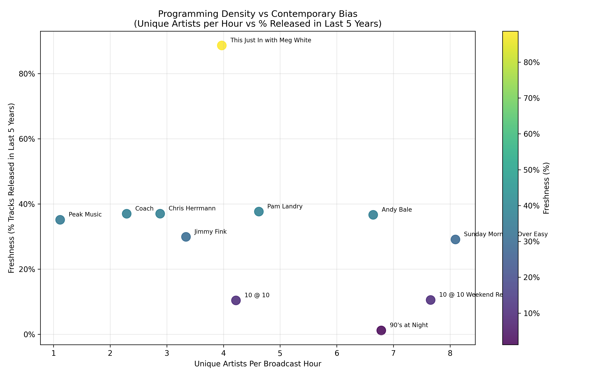

# Radio Programming Analytics Pipeline

## Overview

An end-to-end data pipeline that scrapes radio playlist data, resolves tracks into
canonical entities, enriches metadata via the Spotify and MusicBrainz APIs, and
generates structured programming analytics.

The objective is to demonstrate how raw web data can be transformed into a defensible,
queryable database and used to evaluate programming structure, rotation patterns, and
catalog bias -- with explicit attention to data quality at every stage.

------------------------------------------------------------------------

## Dataset

Current dataset (as of 2026-03-31):

- 50 days of hourly playlist data (2026-02-10 to 2026-03-31)
- > 14,000 recorded plays
- ~98.7% Spotify enrichment match rate (2,591 of 2,626 canonical tracks)
- Fully mapped canonical track relationships
- Release year accuracy improved via MusicBrainz cross-reference (113 corrected to date)

------------------------------------------------------------------------

## Architecture

The pipeline is divided into four stages with a clear separation of concerns:

### 1. Ingestion

Scrapes hourly playlist pages from 107.1 The Peak via BeautifulSoup. Idempotent --
unique play timestamp constraint prevents duplicate records on re-run. Anomalies
and ingestion metrics logged to rotating log files.

### 2. Canonicalization

Normalizes artist/title strings and maps multiple raw play records to a single
canonical track entity. Tracks per-play mapping confidence for audit purposes.

### 3. Enrichment

Multi-stage metadata resolution with explicit quality controls:

- **Spotify Web API**: four-stage search fallback (strict to loose), RapidFuzz
  token similarity scoring, manual override table for tracks Spotify consistently
  misses
- **MusicBrainz**: ISRC cross-reference to correct release years for compilations
  and remaster editions -- a known systematic error in Spotify's album metadata.
  MB year is only accepted when it is strictly earlier than Spotify's, preventing
  remaster ISRCs from corrupting records that Spotify already has right
- **Spotify ISRC backfill**: one-time retroactive enrichment of ~2,500 existing
  records at the Spotify daily quota limit (~600/day), fully idempotent
- **Artist career metadata**: Spotify discography pagination for `earliest_release_year`
  per artist entity (842 canonical artists)

All enrichment is rate-limited, idempotent, and logs actionable failure summaries.
Records that cannot be resolved are explicitly closed (`NO_MATCH`, `NON_MUSIC`)
rather than left in an ambiguous retry loop.

### 4. Analytics

Computes structured programming metrics:

- Artist diversity (Shannon entropy)
- Unique artists per broadcast hour (normalized)
- Exclusive artist percentage
- Album release year distribution (per-show box plot)
- Freshness (% of tracks released within rolling windows of 8, 16, 24 weeks)
- Era continuity: consecutive-pair year gap analysis across shows
- Wednesday freshness analysis: tests station's public programming claim that
  each Wednesday hour features at least one new track
- Weekly fresh track reports (top 5 most-played recent tracks per ISO week)
- **Show clustering**: four-pass hierarchical clustering (Ward linkage) comparing
  shows on scalar programming features (era, freshness, rotation depth, exclusivity)
  and repertoire overlap (binary cosine similarity over a rolling 60-day window).
  Passes include scalar-only, repertoire-only, and two combined weightings to test
  structural robustness

**Release year accuracy:** all year-dependent analytics use a `best_year` derived
field that prefers the MusicBrainz original release year over the Spotify album year
when MB data is available and strictly earlier. This corrects for the systematic
error of tracks matched to compilation or remaster albums.

Detailed findings, methods, and cluster narratives are documented in
[ANALYSIS.md](ANALYSIS.md). Interactive output files are in
[analytics/outputs/](analytics/outputs/).

------------------------------------------------------------------------

## Key Findings

Even with two months of data, structural differences between programs emerge:

- Some shows maximize artist diversity per broadcast hour
- Others maintain tighter rotational patterns
- Certain programs skew strongly toward contemporary releases
- Era-defined programming is visible through release-year metrics
- Wednesday programming shows a modest but consistent freshness edge at tight
  thresholds (8w, 16w), consistent with the station's stated policy -- though not
  dramatically distinct from other days

The visualization below maps programming density against contemporary bias:



Outliers reflect distinct programming strategies rather than random variation.

------------------------------------------------------------------------

## Data Quality and Production Patterns

Several patterns were applied that are typical of production data pipelines:

- **Idempotency**: every pipeline stage is safe to re-run; duplicate inserts are
  detected and logged, not silently dropped or duplicated
- **Explicit status tracking**: enrichment records carry a lifecycle status
  (`PENDING`, `SUCCESS`, `FAILED`, `NO_MATCH`, `NON_MUSIC`) so the audit layer
  can distinguish actionable failures from intentionally closed records
- **Domain validation at write time**: numeric fields from external APIs (release
  years, etc.) are validated against plausible bounds before storage; implausible
  values are nulled and logged rather than stored silently
- **Rate limit handling**: all external API calls are rate-limited; Spotify quota
  exhaustion triggers a clean abort with state preserved for the next run
- **Audit pipeline**: post-ingest audit runs automatically after each scrape,
  flagging low-play hours, unenriched tracks, and mapping anomalies
- **Structured logging**: rotating log files per pipeline stage; warnings for
  first-time enrichment failures and override fetch failures surface immediately

------------------------------------------------------------------------

## Tech Stack

- Python (.venv)
- SQLite
- pandas
- BeautifulSoup (scraping)
- requests
- RapidFuzz (fuzzy string matching)
- Spotify Web API (track metadata, artist metadata)
- MusicBrainz API (original release year cross-reference)
- Plotly (interactive HTML visualizations)
- matplotlib (static scatter plot)

------------------------------------------------------------------------

## Entry Points

```bash
python rs_main.py scrape      # Daily ingestion + audit
python rs_main.py weekly      # Enrichment run (Spotify + artist metadata)
python rs_main.py analyze     # All analytics + visuals
python rs_main.py audit       # Standalone audit
python rs_main.py enrich-meta # Backfill spotify_isrc + spotify_album_type
python rs_main.py mb-enrich   # MusicBrainz ISRC lookup for compilation/remaster tracks
python rs_main.py backfill --start YYYY-MM-DDTHH:MM --end YYYY-MM-DDTHH:MM
```

Scheduled via Windows Task Scheduler. `scrape` and `weekly` run automatically;
`enrich-meta` and `mb-enrich` are run in sequence during the active backfill phase.

------------------------------------------------------------------------

## Design Principles

- Idempotent ingestion and enrichment
- Explicit state tracking at every stage
- Clear separation between ingestion, normalization, enrichment, and analytics
- Minimal silent failure -- errors surface through structured logging and audit output
- Domain validation of external API data before storage

------------------------------------------------------------------------

## Author

Independent quantitative analytics portfolio project.
Developed with assistance from Claude Code (Anthropic).
